**********************
Módulo de Contabilidad
**********************

Información General
-------------------

Un Esquema Contable es una combinación de los principios contables estándar nacionales, un método de coste y una moneda. 

No hay que preocuparse acerca de que elementos introducir con cada transacción,  Libertya genera todas las operaciones contables automáticamente ya que las cuentas de derivan de la operación del documento. Para esto, el Esquema Contable define las cuentas por defecto para uso en transacciones generadas por el sistema. Ejemplo contabilidad de las facturas. 

Estas cuentas se usan como valor por defecto para las Entidades Comerciales, Almacenes, Proyectos, Banco, Impuesto y Libro de Caja. Puede ser cambiadas a nivel individual. 

El objetivo es generar todos los registros contables. Consecuentemente, todas las 
cuentas necesarias están predeterminadas. Por ejemplo, si se vende un producto, se usara la cuenta de ventas para este producto. Esto permite definir las cuentas una única vez para ese producto. Entonces definimos una única vez y así no hay que preocuparse con las consecuencias contables cuando se crean nuevos documentos. 

En Libertya el proceso de generar el asiento automático, también denominado procesado de contabilidad, puede ocurrir cuando un documento es procesado o puede hacerse en un modo por lotes cuando el servidor de aplicaciones esta configurado y corriendo, en este caso es automático para el usuario.

Con la arquitectura única de Libertya se puede también restablecer la contabilidad para toda o parte de su organización para acomodar cambios hechos en una organización. Cuando se genera un asiento en un periodo contable cerrado, causa un fallo en el procesamiento del asiento. 

En la mayor parte de los casos no hay necesidad de realizar asientos manuales. Al contrario de la mayoría de los sistemas Libertya automáticamente genera y asienta las consecuencias contables o asientos en el libro diario para cada documento procesado, no hay necesidad de introducir asientos en el libro diario para las ventas diarias. 

Algunos procedimientos sin embargo requieren de asientos manuales, incluyendo la depreciación de activo fijo, pago de dividendos, etc. en esas situaciones se debe introducir los asientos utilizando la ventana Carga de Asientos Manuales.

Esquema Contable
----------------

1. Acceder con el perfil "Administración" a la opción del menú, Contabilidad →  Esquema Contable, el sistema presenta una ventana como lo muestra la Imagen 41-1.

2. Datos Generales
    - Control de Período Automático, permite controlar la apertura y cierre de períodos de forma manual, permitiendo el ingreso de comprobantes con fechas de meses anteriores.

.. figure:: _static/images/ly_contabilidad_40.png
    :alt: Contabilidad
    :align: center
    :figclass: align-center

    Imagen 41-1: Esquema Contable → Datos Generales

Configuración de cuentas contables por defecto
----------------------------------------------

1. Acceder a la pestaña **Predeterminados**, el sistema presenta una ventana como lo muestra la Imagen 41-2.
2. En esta pestaña puede modificarse los valores que por defecto el sistema asigna en el alta de entidades.

.. figure:: _static/images/ly_contabilidad_41.png
    :alt: Contabilidad
    :align: center
    :figclass: align-center

    Imagen 41-2: Esquema Contable → Cuentas por Defecto

Elemento Contable
-----------------

Permite la gestión del Plan de Cuentas de la organización.

1. Acceder con el perfil "**Administración**" a la opción del menú, **Contabilidad** → **Elemento Contable**, el sistema presenta una ventana como lo muestra la Imagen 42 - 1.
2. Acceder a la pestaña Valor del Elemento, , el sistema presenta una ventana como lo muestra la Imagen 42 - 2. Despliega en forma de árbol el plan de cuentas, permitiendo su gestión, modificando elementos, agregando y re-ubicando en el árbol y eliminando.

.. figure:: _static/images/ly_contabilidad_42.png
    :alt: Contabilidad
    :align: center
    :figclass: align-center

    Imagen 42 - 1: Elemento Contable → Datos Generales

.. figure:: _static/images/ly_contabilidad_43.png
    :alt: Contabilidad
    :align: center
    :figclass: align-center

    Imagen 42 - 2: Elemento Contable → Cuentas Contables

**Nota**: es necesario respetar las convenciones de nomenclatura de las cuentas contables a la vez que su correcto agrupamiento en el árbol.

Contabilización de documentos
-----------------------------

**Generalidades**

- El sistema trabaja en base a contabilidad automática con asientos modelos de cada documento.
- El asiento puede visualizarse desde el registro del documento.
- Es posible disparar la contabilización del documento de forma manual.
- Es posible regenerar el asiento contable del documento de forma manual.

1 - Facturas, Notas de Crédito y Doc. No Fiscales - Transacciones de Compra

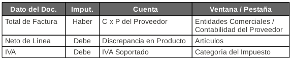

    Imagen 43-1: Contabilidad de documentos

2 - Facturas, Notas de Crédito y Doc. No Fiscales - Transacciones de Venta

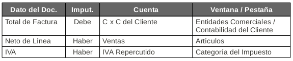

    Imagen 43-2: Contabilidad de documentos

3 - Cobros y Pagos - Medios de Pago

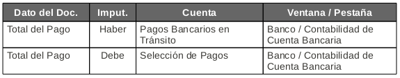

    Imagen 43-3: Contabilidad de documentos

4 - Cobros y Pagos - Medios de Pago con un Cargo asociado al Pago

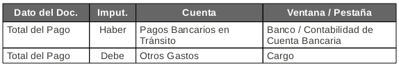

    Imagen 43-4: Contabilidad de documentos

5 - Cobros y Pagos - Medios de Cobro

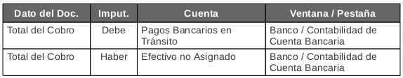

    Imagen 43-5: Contabilidad de documentos

6 - Cobros y Pagos - Medios de Cobro con un Cargo asociado al Cobro

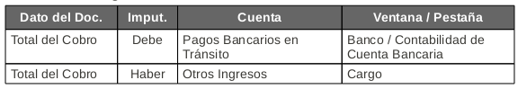

    Imagen 43-6: Contabilidad de documentos

7 - Libros de Caja

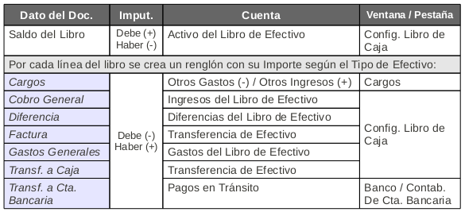

    Imagen 43-7: Contabilidad de documentos

8 - Ordenes de Pago - Asignación de Pago (Cheque, Transferencia, Tarjeta)

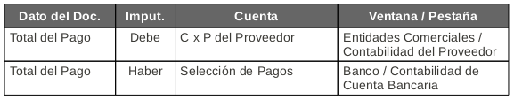

    Imagen 43-8: Contabilidad de documentos

9 - Ordenes de Pago - Asignación de Pago (Efectivo)

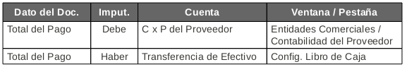

    Imagen 43-9: Contabilidad de documentos

10 - Ordenes de Pago - Asignación de Nota de Crédito

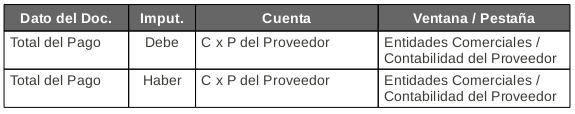

    Imagen 43-10: Contabilidad de documentos

11 - Recibo de Clientes - Asignación de Cobro (Cheque, Transferencia, Tarjeta)

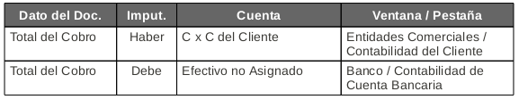

    Imagen 43-11: Contabilidad de documentos

12 - Recibo de Clientes - Asignación de Cobro (Efectivo)

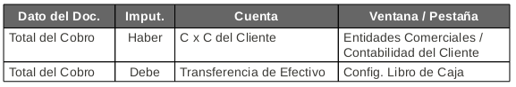

    Imagen 43_12: Contabilidad de documentos

13 - Recibo de Clientes - Asignación de Nota de Crédito

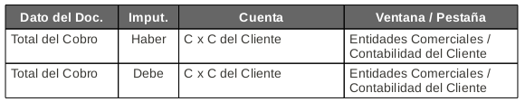

    Imagen 43-13: Contabilidad de documentos

14 - Extractos Bancarios - Conciliación de Pagos

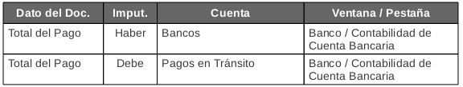

    Imagen 43-14: Contabilidad de documentos

15 - Extractos Bancarios - Conciliación de Pagos, si la línea de extracto es un Cargo

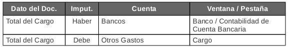

    Imagen 43-15: Contabilidad de documentos

16 - Extractos Bancarios - Conciliación de Cobros

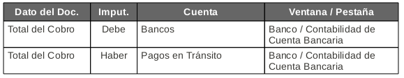

    Imagen 43-16: Contabilidad de documentos

17 - Extractos Bancarios - Conciliación de Cobros, si la línea de extracto es un Cargo

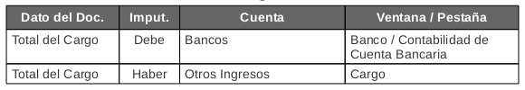

    Imagen 43-17: Contabilidad de documentos

18 - Movimientos de Inventario - Remitos de Entrada (Compra)

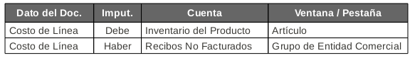

    Imagen 43-18: Contabilidad de documentos

19 - Movimientos de Inventario - Remitos de Entrada (Compra) - Asignación de Remito - Factura

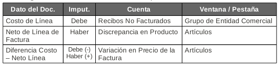

    Imagen 43-19: Contabilidad de documentos

20 - Movimientos de Inventario - Remitos de Salida (Ventas)

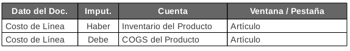

    Imagen 43-20: Contabilidad de documentos

21 - Movimientos de Inventario - Inventario Físico - Diferencia de Inventario

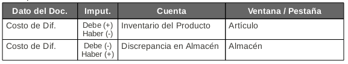

    Imagen 43-21: Contabilidad de documentos

22 - Movimientos de Inventario - Inventario Físico - Cargo en Cuenta

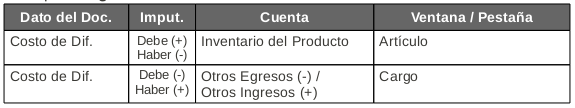

    Imagen 43-22: Contabilidad de documentos

23 - Movimientos de Inventario - Movimiento de Mercadería

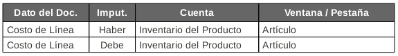

    Imagen 43-23: Contabilidad de documentos

Cuentas Contables por defecto en registros
------------------------------------------

Para cualquier ítem se debe seguir el mismo procedimiento:

1. Acceder a la pestaña Contabilidad del registro. En nuestro ejemplo de la Cuenta de un Banco, el sistema presenta una ventana como lo muestra la Imagen 44.
2. Seleccionar la Organización.
3. Seleccionar en el campo Cuenta, la cuenta a cambiar.
4. Guardar los cambios.
5. Confirmar la operación presionando el botón verde.

.. figure:: _static/images/ly_contabilidad_44.png
    :alt: Contabilidad
    :align: center
    :figclass: align-center

    Imagen 44: Cambio de Cuentas Contables

Asientos Manuales
-----------------

1. Acceder con el perfil "Administración" a la opción del menú, Contabilidad → Carga de Asientos Manuales, el sistema presenta una ventana como lo muestra la Imagen 45.
2. **Lote**,  el sistema presenta una ventana como lo muestra la Imagen 45:
    - Nro. de Documento, el sistema lo ingresa de forma automática en caso que no se especifique.
    - Descripción.
    - Tipo de Documento.
    - Fecha del Documento.
    - Fecha de Aplicación de CG.

Completar, es la opción para procesar el asiento una vez cargados el Diario y Líneas.

3. **Diario**,  el sistema presenta una ventana como lo muestra la Imagen 46.
Tipo de Documento.
Fecha del Documento.
Fecha de Aplicación de CG.

4. **Línea**,  el sistema presenta una ventana como lo muestra la Imagen 47.
    - Cuenta Contable
    - Descripción.
    - Debe.
    - Haber.

.. figure:: _static/images/ly_contabilidad_45.png
    :alt: Contabilidad
    :align: center
    :figclass: align-center

    Imagen 45: Carga de Asientos Manuales - Lote

.. figure:: _static/images/ly_contabilidad_46.png
    :alt: Contabilidad
    :align: center
    :figclass: align-center

    Imagen 46: Carga de Asientos Manuales - Diario

.. figure:: _static/images/ly_contabilidad_47.png
    :alt: Contabilidad
    :align: center
    :figclass: align-center

    Imagen 47: Carga de Asientos Manuales - Línea

