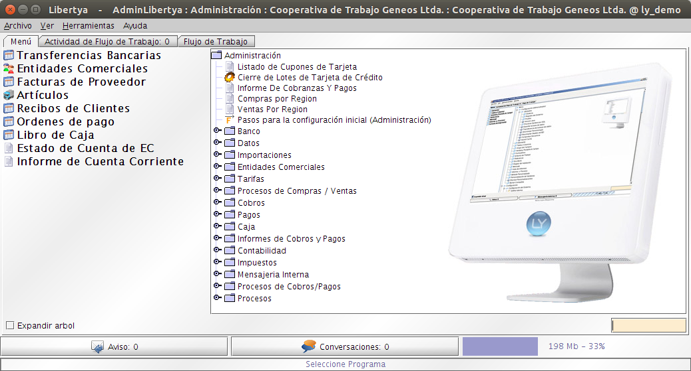
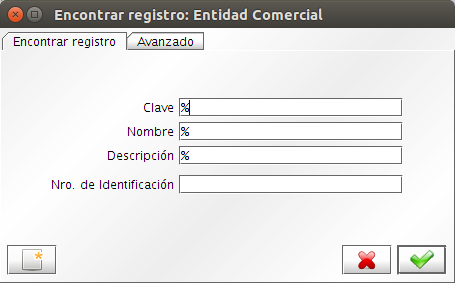

************************
Estructura de Aplicación
************************

Pantalla principal
------------------

Una vez validados los datos de acceso, el sistema presenta la ventana principal, como puede verse a continuación:

    Imagen 3: Pantalla Principal

Área de Trabajo
---------------

En el menú de la aplicación (área a la derecha) aparecen todos los componentes a los que se tiene acceso.

El menú se construye en modo árbol de forma que se pueden agrupar los componentes en carpetas. La configuración depende de los permisos que tenga el usuario y por lo tanto del rol con el que haya hecho login. 

Existe dos manera de navegar a través del menú: 

	1. Haciendo doble clic con el botón de mouse en las carpetas, y con un solo clic para que se abra la ventana, procesos o informe a los que se quiera acceder. 
	2. La aplicación cuenta con una búsqueda sobre el menú, abajo a la derecha existe un campo de texto que nos permite ingresar el nombre de la utilidad que deseamos utilizar (Ventana, proceso o informe). Cuando se presiona la tecla Enter va a buscar la palabra ingresada, si existe mas de una palabra presionando de nuevo Enter salta a la siguiente opción. Una vez encontrada la funcionalidad con la tecla Ctrl + Enter se puede acceder a la funcionalidad. 

Iconos del menú 
---------------

En el árbol que forma el menú podemos encontrar cinco clases de iconos: 

	1. **Carpetas:** Cada carpeta contiene más elementos, ya sea ventanas de trabajo , procesos o informes. Cada carpeta contempla una temática del sistema, así es como podemos encontrar carpetas denominadas VENTAS, ALMACÉN, COMPRAS, etc. Para ver el contenido de una carpeta, haga clic con el botón izquierdo del mouse sobre el botón que se encuentra justo a la izquierda de la carpeta a expandir. 
	2. **Ventanas:** Permite la introducción, consulta y modificación de datos, y desde ella se realizan la mayoría de actividades de interacción del usuario y la aplicación.
	3. **Procesos:** Partiendo de los parámetros, datos o condiciones que asigne e introduzca el usuario, la aplicación realizara operaciones automáticas como la generación de albaranes o facturas, procesos de pedidos, etc.
	4. **Informes:** Permite visualizar e imprimir la información de la aplicación según las condiciones definidas por el usuario. Por ejemplo permite visualizar los vencimientos, los últimos movimientos de stock, etc. Cualquier documento salida del sistema de gestión es factible de ser procesado como un informe.
	5. **Flujo de trabajo:** Muestra una serie de actividades relacionadas entre si, que deben de irse completando en un orden dado, a fin de alimentar de datos de las actividades siguientes y obtener un resultado determinado. Ejemplos típicos son la configuración de artículos y entidades comerciales, o todos los sucesivos pasos de un proceso de negocio. Los flujos de trabajo se utilizaran, típicamente, por los usuarios encargados de la carga inicial de datos y mantenimiento de la aplicación con el fin de seguir un protocolo o procedimiento común en todos los casos que normalice un determinado proceso de negocio complejo.

Adicionalmente, se dispone de la barra de acceso rápido situada a todo lo largo de la parte izquierda del menú. Para añadir ventanas o procesos a dicha barra, solo hay que hacer clic con el botón derecho sobre el elemento para que se visualice la opción de Añadir a barra, y confirmar dicho mensaje con un clic del botón izquierdo del ratón.

Estructura de una ventana
-------------------------

En algunas de las ventanas, debido a la alta cantidad de registros que contiene, aparecerá una ventana inicial de selección o de búsqueda similar a la que muestra la figura siguiente:

    Imagen 4: Ventana de búsqueda de registros

En función de los parámetros ingresados el sistema filtra los resultados que aparecen en una ventana con la siguiente estructura:

.. figure:: _static/images/ly_banco.png
    :alt: Estructura de Ventanas
    :align: center
    :figclass: align-center

    Imagen 5: Estructura de Ventanas

Una ventana se organiza segmentando la información en Pestañas, para este caso como un banco puede tener varias cuentas tendremos esa relación representada en Pestañas anidadas, como puede verse a continuación:

.. figure:: _static/images/ly_cuenta.png
    :alt: Estructura de Ventanas - Pestaña
    :align: center
    :figclass: align-center

    Imagen 6: Estructura de Ventanas - Pestaña

En todas las ventanas de la aplicación se encontrara una estructura común en la parte superior. Por una parte, tenemos el menú compuesto por una serie de ventanas desplegables (Archivo, Edición, Ver, Ir, Herramientas, Ayuda).

Como ejemplo, dentro de Herramientas aparece la opción **Preferencias**. Las preferencias de usuario permite determinar la pantalla del cliente y como reaccionará ante específicas acciones de usuario. Sus opciones son las siguientes: 

	1. **Interfaz de Usuario:** El botón de interfaz de usuario permite la selección de la apariencia y estilo de Libertya. Se puede seleccionar diferentes estilos y colores y tener una vista previa de su selección antes de guardarla. 
	2. **Guardado Automático:** Si se selecciona Guardado Automático, los cambios se guardaran automáticamente cuando se navegue por una única pestaña. Cuando se cambien pestañas debe confirmar la acción independientemente de la opción. 
	3. **Acceso Automático:** Si se selecciona la casilla de verificación Acceso Automático, la ventana de Acceso no se mostrara cuando se inicie Libertya. Se usara el nombre de usuario, contraseña, perfil, cliente y organización de la sesión anterior. Si se quiere cambiar algún parámetro de estos debe bloquearse, quitando la selección de esta casilla de verificación y salir de Libertya. La próxima vez que se ingrese en la aplicación se mostrara la ventana de acceso y se podrá insertar los valores que se desee. Esta opción puede desactivarse para sistemas que requieran alta seguridad. 
	4. **Contraseña Almacenado:** Si se selecciona la casilla de verificación Recordar Contraseña, Libertya recordará el usuario y la contraseña con el que se accedió en la anterior sesión. Estos valores pueden ser sobrescritos fuera necesario.
	5. **Mostrar Pestañas Contables / Mostrar Pestañas de Traducción:** Si se selecciona la casilla de verificación Mostrar Pestañas Contables / Mostrar Pestaña de Traducción, Libertya mostrará las pestañas contables y de traducción en aquellas ventana que contengan este tipo de pestañas. 
	6. **Traducción:** Las pestañas de traducción solo debería estar disponibles para los administradores de sistema, y las contables para el departamento de contabilidad o los usuarios debidamente cualificados para la parametrización de cuentas contables de la aplicación. Por esto, lo común será que los usuarios normales tengan estas dos casillas desactivadas y en modo de lectura solamente.
	7. **Crear Objetos en el Servidor:** Se selecciona la casilla de verificación Crear Objetos en el Servidor solo si esta trabajando remotamente y se quiere reducir el tráfico de red. La contrapartida es que los objetos que son creados en el servidor requieren más recurso de servidor, por lo que puede ser necesario una mayor cantidad de memoria y de espacio de disco. 
	8. **Imprimir Siempre Vista Previa:** Si se selecciona esta casilla de verificación, Libertya mostrará una pantalla de Vista Previa antes de imprimir cualquier documento, informe o pantalla. Una vez visualizado, aprobado y validado dicho documento o informe se puede imprimir directamente. 
	9. **Nivel de Mensajes de Logs:** El nivel de depuración indica el nivel de detalle de los mensajes de la bitácora de errores, información e incidencias que genera Libertya en tiempo real. Se puede querer modificar esta opción cuando requiera soporte para un problema específico y el servicio de soporte solicite la información que esta opción proporciona. Esta utilidad no obstante, solo debería ser modificada por los administradores del sistema o usuarios profesionales debidamente cualificados que entiendan lo que están haciendo. 
	10. **Impresora:** Los campos de Impresión permiten seleccionar la impresora que será usada para los documentos e informes. Sobrescribirá el valor introducido o tomado por defecto cuando se inicio sesión en Libertya. 
	11. **Fecha:** El campo fecha permite seleccionar la fecha que será usada en los documentos. Sobrescribirá el valor entrado o tomado por defecto al iniciar la sesión de Libertya.

Justo debajo se encuentra la barra de herramientas (botonera), con una serie de iconos comunes a todas las ventanas (crear, guardar, eliminar, buscar, imprimir, ver como grilla, etc). A continuación, en la ventana se encuentran los campos de la ventana, que permite visualizar y/o introducir nuevos datos dependiendo de la configuración en cada momento. Los campos en rojo deben contener obligatoriamente algún dato para poder guardar el registro. Para pasar de un campo a otro se realiza con el ratón o bien con la tecla Tab.

    Imagen 7: Barra de Herramientas

De izquierda a derecha:

	1. Deshacer cambios
	2. Nuevo registro
	3. Eliminar registro
	4. Guardar registro
	5. Actualizar registro
	6. Buscar registros
	7. Adjuntos: permite adjuntar documentos a un registro de la ventana.
	8. Vista:  formulario (ingreso de datos) y grilla (vista tipo tabla).
	9. Historial de registros: en el caso de algunas ventanas los registros quedan ocultos tras un cierto tiempo de antigüedad para facilitar la navegación por la ventana. Con este botón se puede seleccionar la antigüedad de los registros que se muestran, pero solo en ese acceso a la ventana, cuando se vuelva a iniciar la ventana volverá a la vista original. Si siempre se desea ingresar con otro periodo de antigüedad, solo el administrador del sistema podrá configurarlo.
	10. Inicio
	11. Pestaña anterior
	12. Pestaña siguiente
	13. Primer registro
	14. Registro anterior
	15. Registro siguiente
	16. Último registro
	17. Imprimir (en los casos que la ventana lo permite)
	18. Flujos de trabajo activos (en los contextos que tiene sentido)
	19. Exportar
	20. Conversación
	21. Salir

