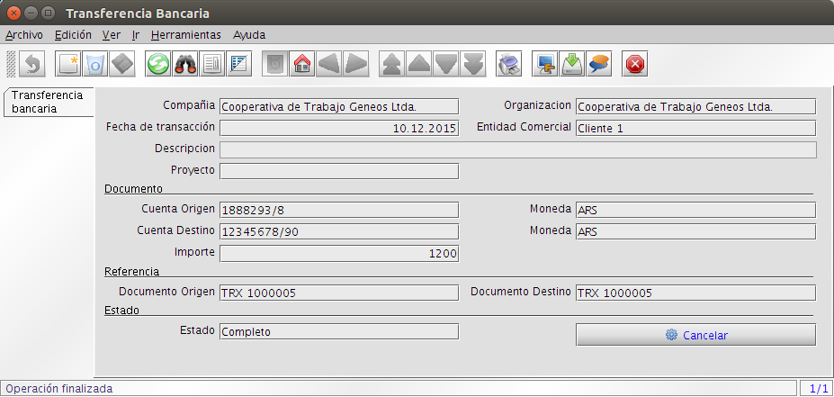

******************
Módulo de Finanzas
******************

Bancos
------

Desde esta ventana se configuran todas las cuentas bancarias con las que vaya a trabajar la compañía. En la primera pestaña se definirán los datos generales de la cuenta bancaria, su nombre, dirección, etc. 

Adicionalmente se se activa la selección de Banco Propio, se podrá utilizar para las operaciones bancarias de cobros y pagos de la propia compañía. Donde podemos operar con varios bancos y cuentas a la vez. 

1. Acceder con el perfil "Administración" a la opción del menú, **Banco** →  **Banco**, el sistema presenta una ventana como lo muestra la Imagen 25.
2. Datos Generales → Campos a ingresar:
    - Nombre
    - Descripción
    - Dirección
    - Identificador

.. figure:: _static/images/ly_bancos_25.png
    :alt: Fórmula
    :align: center
    :figclass: align-center

    Imagen 25: Bancos

**Cuenta** 

1. Acceder a la pestaña Cuenta, el sistema presenta una ventana como lo muestra la Imagen 26.
2. Datos Generales → Campos a ingresar:
    - Sucursal.
    - Nro. Cuenta.
    - Moneda.
    - Tipo de cuenta bancaria.
    - Cuenta de Cheques en Cartera, se habilita si el tipo de cuenta es Cheque, sirve para definir las cuentas que van a funcionar para mantener la cartera de cheques de Terceros.

.. figure:: _static/images/ly_bancos_26.png
    :alt: Fórmula
    :align: center
    :figclass: align-center

    Imagen 26: Cuentas

**Documentos de Cuenta Bancarias**

Se usan para definir las chequeras en las cuentas de cheques propios.

1. Acceder a la pestaña **Documento de Cuenta Bancaria**, el sistema presenta una ventana como lo muestra la Imagen 27.
2. Datos Generales → Campos a ingresar:
    - Nombre.
    - Forma de Pago.
    - Secuencia.

.. figure:: _static/images/ly_bancos_27.png
    :alt: Fórmula
    :align: center
    :figclass: align-center

    Imagen 27: Documento de Cuenta Bancaria

Operaciones con Bancos
----------------------

**Transferencias Bancarias**

Permite realizar transferencias desde cuentas de terceros a cuentas propias, desde cuentas propias a cuentas de terceros y entre cuentas propias.

1. Acceder con el perfil "**Administración**" a la opción del menú, **Banco** →  **Transferencia Bancaria**, el sistema presenta una ventana como lo muestra la Imagen 28.
2. Datos Generales → Campos a ingresar:
    - Fecha.
    - Entidad Comercial.
    - Cuenta Origen.
    - Cuenta Destino.
    - Importe.

    Imagen 28: Transferencia Bancaria

**Boleta de Depósitos**

Permite hacer el depósito de valores a una cuenta bancaria propia o de terceros. Primero se ingresan los datos generales y luego se ingresan los valores a depositar.

1. Acceder con el perfil "Administración" a la opción del menú, Banco →  Boletas de Depósito, el sistema presenta una ventana como lo muestra la Imagen 29.
2. Datos Generales → Campos a ingresar:
    - Nro. de Documento (lo puede dar automático el sistema)
    - Entidad Comercial.
    - Cuenta Bancaria.
    - Fecha de Depósito.
    - Fecha de Acreditación.
    - Moneda.
    - Acción.

.. figure:: _static/images/ly_bancos_29.png
    :alt: Boleta
    :align: center
    :figclass: align-center

    Imagen 29: Boleta de Depósito - Datos generales

**Valores a Depositar**

1. Acceder a la pestaña Valores a Depositar, el sistema presenta una ventana como lo muestra la Imagen 30. El ingreso de los valores actualiza el monto de la cabecera de la boleta.
2. Campos a ingresar:
    - Cuenta origen.
    - Cheque.

    Imagen 30: Boleta de Depósito - Valores a depositar

    Cajas
-----

**Configuración de Libro de Caja**

Define la estructura general de los tipos de cajas diarias.

1. Acceder con el perfil "**Administración**" a la opción del menú, **Caja** →  **Configuración de Libro de Caja**, el sistema presenta una ventana como lo muestra la Imagen 31.
2. Datos Generales → Campos a ingresar:
    - Nombre.
    - Descripción.
    - Moneda.
    - Predeterminado.
    - Tipo de Caja, en esta instancia trabajamos siempre con el tipo Caja General.

    Imagen 31: Configuración de Libro de Caja

**Libro de Caja**

El libro de caja es donde se maneja el efectivo. Aquí se pueden registrar los ingresos y egresos de efectivo, ingresos de cheques y demás. Por ejemplo, si se paga una factura en efectivo, se debe crear una línea con la factura y el importe, para que se registre la cancelación de la misma.

1. Acceder con el perfil "**Administración**" a la opción del menú, **Caja** →  **Libro de Caja**, el sistema presenta una ventana como lo muestra la Imagen 32.
2. Datos Generales → Campos a ingresar:
    - Libro de Caja.
    - Nombre, es asignado por el sistema con la referencia del Libro de Caja y la fecha, pero puede modificarse
    - Fecha de Estado de Cuenta.
    - Fecha de Aplicación CG (Contabilidad General).
    - Saldo Inicial, se carga de forma automática con el saldo de la última caja cerrada.
    - Completar, es la opción para cerrar el Libro de Caja y completar las transacciones.

.. figure:: _static/images/ly_cajas_32.png
    :alt: Cajas
    :align: center
    :figclass: align-center

    Imagen 32: Libro de Caja

Línea de Caja

Permite el ingreso de transacciones de caja. Los tipos que soporta son:

Gastos Generales, permite registrar gastos o egresos sin comprobantes.
Cobros Generales, permite registrar cobros o ingresos sin comprobantes.
Diferencia de Caja
Transferencia a Caja, permite transferir fondos desde una cuenta a la caja.
Transferencia a Cuenta Bancaria, permite transferir fondos desde la caja a una cuenta.
Factura, permite registrar el pago o la cobranza de facturas en efectivo.

1. Acceder a la pestaña Línea de Caja, el sistema presenta una ventana como lo muestra la Imagen 33.
2. Datos Generales → Campos a ingresar:
    - Descripción.
    - Entidad Comercial.
    - Tipo de Efectivo.
    - Importe.
    - Completar, es la opción para cerrar el registro en la Línea de Caja y completar la transacción.

.. figure:: _static/images/ly_cajas_33.png
    :alt: Cajas
    :align: center
    :figclass: align-center

    Imagen 33: Línea de Caja

Operaciones con Cajas
---------------------

**Gastos Generales**

Permite registrar gastos o egresos sin comprobantes.

.. figure:: _static/images/ly_cajas_34.png
    :alt: Gastos
    :align: center
    :figclass: align-center

    Imagen 34: Linea de Caja – Gastos Generales

**Cobros Generales**

Permite registrar cobros o ingresos sin comprobantes.

    Imagen 35: Linea de Caja – Cobros Generales

**Diferencia de Caja**

Permite registrar diferencias de efectivo.

.. figure:: _static/images/ly_cajas_36.png
    :alt: Gastos
    :align: center
    :figclass: align-center

    Imagen 36: Linea de Caja – Diferencias de Efectivo

**Transferencia a Caja**

Permite transferir fondos desde un Libro de Caja activo a otro.

    Imagen 37: Linea de Caja – Transferencias entre Libros de Caja

**Transferencia a Cuenta Bancaria**

Permite transferir fondos desde o hacia una cuenta bancaria.

.. figure:: _static/images/ly_cajas_38.png
    :alt: Transferencia
    :align: center
    :figclass: align-center

    Imagen 38: Linea de Caja – Transferencias entre Libros de Caja

**Factura**

Permite registrar el pago o la cobranza de facturas en efectivo.
    
    .. figure:: _static/images/ly_cajas_39.png
        :alt: Factura
        :align: center
        :figclass: align-center
    
        Imagen 39: Linea de Caja – Cobranzas o Pagos de facturas en efectivo.

