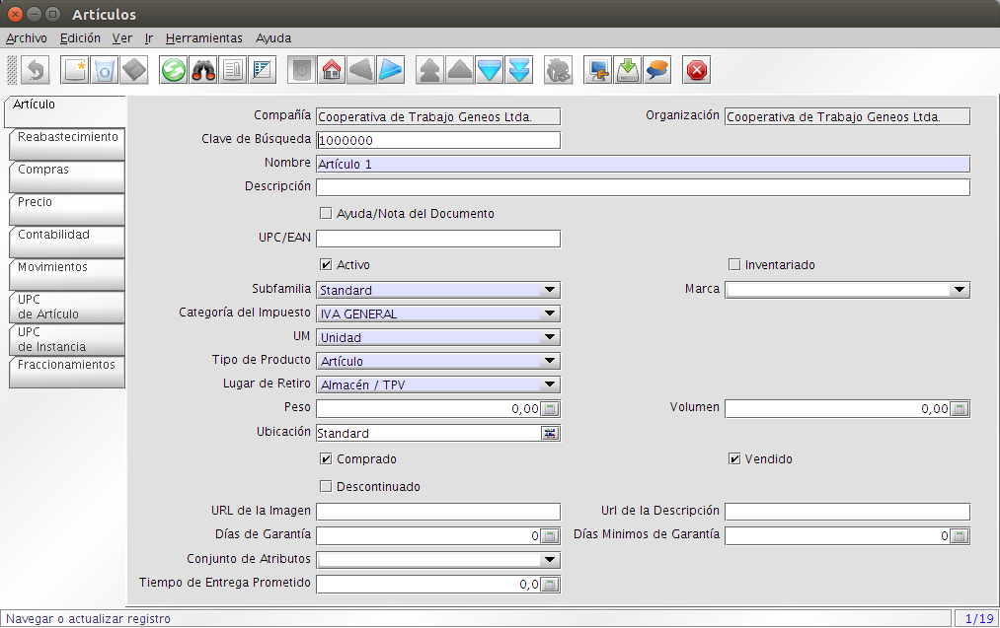
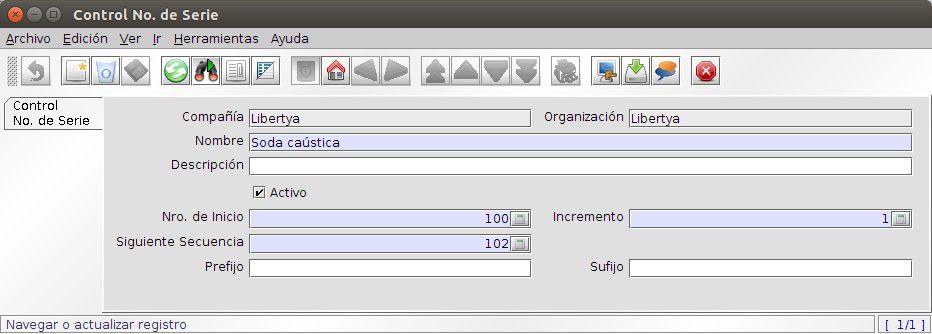

*************************************
Principales Maestros de la Aplicación
*************************************

*. Entidades Comerciales
	*. Clientes
	*. Proveedores
	*. Empleados
*. Artículos
*. Conjuntos de Atributos
*. Lista de Precios

Entidades Comerciales
---------------------

Las entidades Comerciales se usan para ingresar al sistema Proveedores, Clientes y Empleados.

**Proveedores**

1. Acceder a la opción de menú **Entidades Comerciales → Entidades Comerciales**, por defecto ingresa a la primera pestaña de **Entidad Comercial**, el sistema presenta una ventana como lo muestra la Imagen 8.
2. Campos a ingresar:
	* Clave de Búsqueda (si no se ingresa el sistema genera una incremental).
	* Nombre.
	* Descripción. 
	* Categoría de IVA
	* Tipo de Identificación
	* Número de Identificación
	* Grupo
3. Guardar
4. Seleccionar la pestaña **Proveedor**, el sistema presenta una ventana como lo muestra la Imagen 9.
5. Campos a ingresar:
	* Marcar casilla de verificación Proveedor. 
	* Seleccionar la Tarifa de Compras que corresponda.
	* Seleccionar la Forma de Pago que corresponda.
	* Seleccionar el Esquema de Descuentos que corresponda.
	* Seleccionar el Esquema de Vencimientos que corresponda.
6. Guardar
7. Seleccionar la pestaña **Contabilidad**.
8. Campos a ingresar:
	* C x C de Proveedores: es la cuenta contable para los asientos de compras.
9. Guardar
10. Seleccionar pestaña **Localización**, el sistema presenta una ventana como lo muestra la Imagen 10.
11. Campos a ingresar:
	* Ingresar los datos de la Dirección del Proveedor.
12. Guardar

.. figure:: _static/images/ly_prov_gen.png
    :alt: Ventana de búsqueda de registros
    :align: center
    :figclass: align-center

    Imagen 8: Entidades Comerciales

    Imagen 9: Entidades Comerciales - Proveedor

.. figure:: _static/images/ly_prov_dir.png
    :alt: Ventana de búsqueda de registros
    :align: center
    :figclass: align-center

    Imagen 10: Entidades Comerciales - Localización

**Clientes**

1. Acceder a la opción de menú **Entidades Comerciales → Entidades Comerciales**, por defecto ingresa a la primera pestaña de **Entidad Comercial**, el sistema presenta una ventana como lo muestra la Imagen 8.
2. Campos a ingresar:
	* Clave de Búsqueda (si no se ingresa el sistema genera una incremental).
	* Nombre.
	* Descripción. 
	* Categoría de IVA
	* Tipo de Identificación
	* Número de Identificación
	* Grupo
3. Guardar.
4. Seleccionar la pestaña **Cliente**, el sistema presenta una ventana como lo muestra la Imagen 11.
5. Campos a ingresar:
	* Marcar casilla de verificación Cliente. 
	* Seleccionar el Estado de Crédito que corresponda.
	* Ingresar el Límite de Crédito que corresponda.
	* Seleccionar el Esquema de Descuentos que corresponda.
	* Seleccionar la Forma de Pago que corresponda.
	* Seleccionar el Medio de Cobro a Crédito que corresponda.
6. Guardar.
7. Seleccionar la pestaña **Contabilidad**.
8. Campos a ingresar:
	* C x C de Clientes: es la cuenta contable para los asientos de ventas.
9. Guardar.
10. Seleccionar pestaña **Localización**, el sistema presenta una ventana como lo muestra la Imagen 10.
11. Campos a ingresar:
	* Ingresar los datos de la Dirección del Proveedor.
12. Guardar.

    Imagen 11: Entidades Comerciales - Cliente

**Empleados**

1. Acceder a la opción de menú **Entidades Comerciales → Entidades Comerciales**, por defecto ingresa a la primera pestaña de **Entidad Comercial**, el sistema presenta una ventana como lo muestra la Imagen 8.
2. Campos a ingresar:
	* Clave de Búsqueda (si no se ingresa el sistema genera una incremental).
	* Nombre.
	* Descripción. 
	* Categoría de IVA
	* Tipo de Identificación
	* Número de Identificación
	* Grupo
4. Guardar
5. Seleccionar la pestaña **Empleado**, el sistema presenta una ventana como lo muestra la Imagen 12.
6. Campos a ingresar:
	* Marcar casilla de verificación Empleado. 
7. Guardar

.. figure:: _static/images/ly_emp.png
    :alt: Entidades Comerciales – Empleado
    :align: center
    :figclass: align-center

    Imagen 12: Entidades Comerciales - Empleado

Artículos
---------

Los artículos o productos pueden ser aquellos vendibles a clientes, los usados en la fabricación de productos para venta a clientes, los productos comprados por una organización como materias primas, etc. También se utilizan artículos para facturar ítem especiales, en cuyos casos el tipo de artículo varía según la necesidad.

1. Acceder a la opción del menú **Artículos →  Artículos**, por defecto ingresa a la primera pestaña de **Artículo**, el sistema presenta una ventana como lo muestra la Imagen 13.
2. Campos a ingresar:
	* Nombre
	* Descripción.
	* UPC/EAN (Código de barra universal o número de artículo europeo), que con posterioridad permitirá una gestión rápida de stock mediante lectores de código de barra. 
	* Subfamilia.
	* Marca.
	* Categoría de Impuesto
	* Tipo de Producto. Dependiendo de la selección de Tipo de Producto (que puede ser Artículo, Recurso, Servicio o Gasto) la ventana puede cambiar ligeramente.
	* UM es la Unidad de Medida en la que se almacenara este producto. Si se quiere hacer alguna conversión a otra Unidad de Medida, esta Unidad de Medida debe ser más pequeña. Por ejemplo, si se tiene un producto que puede venderse en unidades individuales o paquetes de 6 unidades, la UM definido para el producto deberá ser la unidad. Adicionalmente deberemos definir una conversión de unidades a paquetes de 6 unidades con una tasa de conversión multiplicadora de seis. 
	* Seleccionar la casilla de Comprado y/o Vendido cuando la organización requiera comprar /vender este producto.
3. Guardar.
4. Seleccionar la pestaña **Precio**, el sistema presenta una ventana como lo muestra la Imagen 14.
5. Campos a ingresar:
	* Versión de Tarifa
	* Precio Tarifa
	* Precio 	Ref.
	* Precio Límite (en caso de querer controlar el precio por debajo del cual no puedan cargarse registros con el producto).
6. Guardar.
7. Seleccionar la pestaña **Contabilidad**, el sistema presenta una ventana como lo muestra la Imagen 15.
8. Campos a ingresar:
	* Inventario de producto: es la cuenta contable para los asientos de ventas.
	* Discrepancia de producto: es la cuenta contable para los asientos de compras.
9. Guardar

    Imagen 13: Artículo - Datos Generales

.. figure:: _static/images/ly_art_precio.png
    :alt: Artículo - Datos de Compras
    :align: center
    :figclass: align-center

    Imagen 14: Artículo - Datos de Compras

.. figure:: _static/images/ly_art_contab.png
    :alt: Artículo - Datos Contabilidad
    :align: center
    :figclass: align-center

    Imagen 15: Artículo - Datos Contabilidad

Conjunto de Atributos
---------------------

Los Conjuntos de Atributos, permiten manejar características para diferenciar los lotes de productos y agregar características.

En el contexto del MRP, nos permite gestionar lotes de productos y vencimientos, de modo de poder hacer una trazabilidad, de los lotes que intervienen e cada proceso productivo.

1. Acceder a la opción del menú **Artículos →  Atributos de Artículo**. Por defecto ingresa a la primera pestaña de **Conjunto de Atributos**, el sistema presenta una ventana como lo muestra la Imagen 16.
2. Campos a ingresar:
	* Compañía:
	* Organización
	* Nombre
	* Descripción
	* Activo
	* Instancia del Atributo
	* Lote
	* Lote Obligatorio
	* Control de Lote
	* Nro de Serie
	* Nro de Serie Obligatorio
	* Control de Nro de Serie
	* Clave de relaciones de prod. prefijada
	* Fecha de Garantía
	* Fecha de Garantía Obligatoria
	* Días de Garantía
	* Tipo Obligatorio
	* Caduce
4. Guardar.
5. En caso de requerir características particulares pueden definirse atributos por medio de la pestaña **Uso de Atributos**, el sistema presenta una ventana como lo muestra la Imagen 17.
6. Campos a ingresar:
	* Compañía
	* Organización
	* Conjunto de Atributos
	* Atributo
	* Activo
	* Secuencia
	* Mostrado en descripción
7. Guardar.

.. figure:: _static/images/ly_conjattr_1.png
    :alt: Conjunto de Atributos
    :align: center
    :figclass: align-center

    Imagen 16: Conjunto de Atributos

.. figure:: _static/images/ly_conjattr_2.png
    :alt: Uso de Atributo
    :align: center
    :figclass: align-center

    Imagen 17: Uso de Atributo

Control de Lote
---------------

Permite definir la gestión automática de numeración para los lotes.

1. Acceder a la opción del menú **Artículos →  Atributos de Artículo → Control de Lote del Artículo**. El sistema presenta una ventana como lo muestra la Imagen 18.
2. Campos a ingresar:
	* Compañía
	* Organización
	* Nombre
	* Descripción
	* Activo
	* Nro. de Inicio
	* Incremento
	* Siguiente Secuencia
	* Prefijo
	* Sufijo
3. Guardar

.. figure:: _static/images/ly_ctrlote.png
    :alt: Control de Lote
    :align: center
    :figclass: align-center

    Imagen 18: Control de Lote

Control de No de Serie
----------------------

Permite definir la gestión automática de numeración para gestión de números de serie.

1. Acceder a la opción del menú **Artículos →  Atributos de Artículo → Control de No de Serie**. El sistema presenta una ventana como lo muestra la Imagen 19.
2. Campos a ingresar:
	* Compañía
	* Organización
	* Nombre
	* Descripción
	* Activo
	* Nro. de Inicio
	* Incremento
	* Siguiente Secuencia
	* Prefijo
	* Sufijo
3. Guardar

    Imagen 19: Control de No de Serie

Atributo
--------

Permite definir características particulares asociadas a un Conjunto de Atributos. Esto se hace definiendo una lista de posibles valores a ser seleccionados, asociada al atributo.

1. Acceder a la opción del menú **Artículos → Atributos**. Por defecto ingresa a la primera pestaña de **Atributos**, el sistema presenta una ventana como lo muestra la Imagen 20.
2. Campos a ingresar:
	* Compañía
	* Organización
	* Nombre
	* Descripción
	* Activo
	* Sólo Lectura
	* Tipo de Valor del Atributo
	* Entrada Obligatoria
	* Búsqueda por Atributo
	* Instancia del Atributo 
3. Guardar.
4. Seleccionar la pestaña **Valor de Atributo**, el sistema presenta una ventana como lo muestra la Imagen 21.
5. Campos a Ingresar:
	* Compañía
	* Organización
	* Atributo
	* Clave de Búsqueda
	* Nombre
	* Descripción
	* Activo
	* Secuencia 
6. Guardar

.. figure:: _static/images/ly_attr1.png
    :alt: Artículo → Datos de Compras
    :align: center
    :figclass: align-center

    Imagen 20: Artículo - Datos de Compras

    Imagen 21: Artículo - Datos Contabilidad

