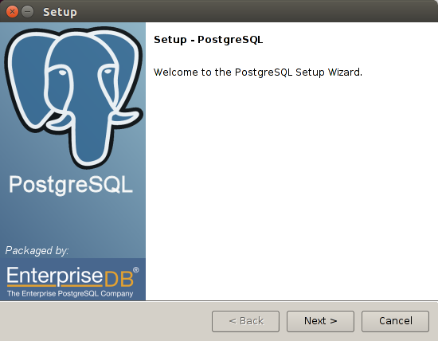

*********************************
Documentación técnica de Libertya
*********************************

Introducción
------------

**Consideraciones**

La presente guía, es desarrollada en el contexto de la instalación de LIbertya ERP sobre la distribución de Linux **Ubuntu**, en otras distribuciones, algunas partes de la guía, pueden requerir alternativas que no serán abordadas.

**Pasos**

    1. Instalación de Java
    2. Instalación de Postgres SQL
    3. Creación de base de datos para Libertya
    4. Instalación de Libertya
    5. Configuración de backups automáticos.
    6. Instalación de Eclipse
    7. Descarga de código de Libertya.
    8. Configuración de Eclipse.

Instalación de Java
-------------------

Oracle JDK es el JDK oficial de Java; como sea, ya no es más proporcionada por Oracle en la instalación por defecto para Ubuntu.

Aún es posible de instalar usando Apt-Get. Para instalar cualquier versión primero hay que ejecutar los siguientes comandos::

	1. sudo apt-get install python-software-properties
	2. sudo add-apt-repository ppa:webupd8team/java
	3. sudo apt-get update

Después, se deben ejecutar los comandos dependiendo de la versión que deseas instalar, para Libertya en su versión 15.03 se debe instalar Oracle JDK 6::

	4. sudo apt-get install oracle-java6-installer

Otra Opción es descargar e instalar de forma manual desde el link:

	`JDK6u45 <http://www.oracle.com/technetwork/java/javase/downloads/java-archive-downloads-javase6-419409.html#jdk-6u45-oth-JPR/>`_

Instalación de Postgres SQL
---------------------------

Libertya funciona actualmente con la versión 8.4 de Postgres SQL.

Para instalar dicha versión, obtenemos el instalador gráfico desde:

	`PostgresSQL8.4 <http://www.enterprisedb.com/postgresql-8422-1-installers-linux64?ls=Crossover&type=Crossover>`_

Luego damos permisos de ejecución y ejecutamos el instalador::

	1. chmod +x postgresql-8.3.23-3-linux-x64.run
	2. sudo ./postgresql-8.3.23-3-linux-x64.run

El sistema presenta el wizard del instalador de Postgres SQL y tenemos que seguir las indicaciones dejando por defecto los valores del puerto e ingresando una clave para el usuario postgres.

    Imagen: Instalador de Postgres SQL

A continuación se deben ajustar algunos parámetros de la instalación. Dependiendo de si nos encontramos en entornos de pruebas o producción, podrían llevarse adelante configuraciones más complejas. Este ejemplo es para una instalación básica en entorno de prueba.

**Configuración en pg_hba.conf**

Agregar las siguientes líneas para permitir el acceso desde la red local::

	host all all 192.168.1.0/24 trust
	host all all 192.168.0.0/24 trust

Nota: en este caso las posibles redes locales son para IP en los rangos 192.168.1.X o 192.168.0.X, estas direcciones deben configurarse para cada caso particular.

**Configuración en postgres.conf**

Agregar o habilitar en caso que no se encuentre, la línea::

	listen_addresses = '*'

**Reiniciar Servidor**

Finalmente para que tome los cambios, se debe hacer un restart de postgres::

	sudo /etc/init.d/postgres restart

Creación de base de datos para Libertya
---------------------------------------

	1. Crear el rol libertya (podemos usar cualquier nombre) en postgres con todos los privilegios.
	2. Crear el usuario libertya (podemos usar cualquier nombre) en postgres con rol libertya.
	3. Crear la base de datos libertya (podemos usar cualquier nombre) asignada al usuario libertya recientemente creado.
	4. Descargamos el backup de la base de datos desde `acá <http://sourceforge.net/projects/libertya/files/libertya/release/1503/multi-platform/dump_libertya_1503ar.sql.zip/download>`_
	5. Restaurar el backup de la base de datos. Podemos hacerlo ingresando por línea de comandos con el usuario postgres (sudo su y su postgres por ejemplo) y corremos el siguiente comando (suponiendo que el script se encuentra en /home/usuario/sql/)::

		psql -U postgres -p 5432 -d libertya -f /home/usuario/sql/dump_libertya_1503ar.sql

Nota: para obtener el sistema con la nacionalización en Argentina es importante que el script sea **dump_libertya_1503ar.sql**.

Nota: dependiendo de la instalación de postgres puede ser necesario crear el lenguaje **plpgsql**, esto se hace con la siguiente sentencia (desde linea de comando o desde pgadmin)::

	CREATE LANGUAGE plpgsql;

Instalación de Libertya
-----------------------

	1. Descargamos el servidor de Libertya desde `acá <http://sourceforge.net/projects/libertya/files/libertya/release/1503/multi-platform/ServidorOXP_V15.03.zip/download>`_
	2. Descomprimimos la carpeta ServidorOXP en un directorio, para nuestro ejemplo /home/usuario/apps/ServidorOXP/
	3. Asignamos permisos de ejecución a los script::
		
		chmod +x *.sh

	4. Ejecutamos el script de configuración::
		
		./Configurar.sh
		
	5. Cargamos los datos solicitados.
	6. Ejecutamos **Comprobar** para validar los datos.
	7. Ejecutamos **Guardar** para guardar los cambios.

Configuración de backups automáticos
------------------------------------

Puede verse la forma de configurar los backups automáticos desde `acá <http://geneos.com.ar/liberado/automatizar-backups-de-la-base-de-datos-de-libertya/>`_

Instalación de Eclipse
----------------------

Descarga de código de Libertya
------------------------------

Configuración y ejecución de Libertya en Eclipse
------------------------------------------------

Configuración y debug de Libertya en Eclipse
--------------------------------------------

